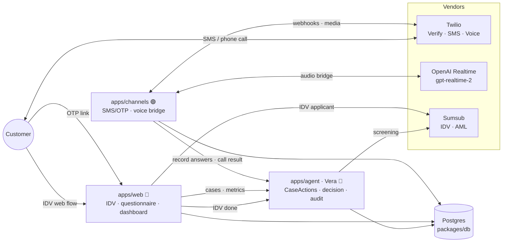

# TrustLine — Vera

> **An AI employee that runs KYC end-to-end.** Vera verifies identity, collects a risk-based questionnaire across web and voice, screens for sanctions/PEP/adverse media, reaches an explainable decision, and writes a complete audit trail — in minutes, not days. When a customer stalls, Vera calls them.

---

## Why it matters

| Metric | Industry today | TrustLine |
|---|---|---|
| Time-to-decision | Days–weeks | Minutes |
| Cost per verification | $13–$130 | Agent marginal cost |
| Re-KYC (periodic refresh) | Largely manual | Automated outbound calls |
| Onboarding abandonment | ~10% average | Rescued by fallback call |
| Straight-through processing | Low | Measurable on live dashboard |

KYC is a large, quantifiable cost centre. TrustLine attacks the slow, manual, high-drop-off parts.

---

## The core flow

```
Customer                  TrustLine
───────                   ─────────
  │  1. Identity check       │
  │─── document + liveness ──▶ Sumsub IDV
  │                          │
  │  2. Questionnaire        │
  │◀── SMS: OTP + web link ──│  (Twilio Verify + Messaging)
  │─── fills form online ───▶│  (OTP-gated web form)
  │    or calls in  ────────▶│  (Vera voice, gpt-realtime-2)
  │                          │
  │  3. Fallback (~1 day)    │
  │◀── Vera calls you ───────│  (Twilio outbound + OpenAI Realtime)
  │                          │
  │  4. Decision             │
  │                          │  sanctions / PEP / adverse media → CLEAR | REFER | REJECT
  │◀── result + audit ───────│  full audit trail written to Postgres
```

Proactive re-verification (ID expiry, periodic re-KYC) re-enters at step 2, reusing the same channel and safety logic.

---

## Monorepo layout

```
apps/
  web/        Next.js 14 + TypeScript              Port 3000   (Cloud Run / Vercel)
              ├── Customer: IDV flow, OTP gate, questionnaire form
              └── Reviewer: case dashboard, metrics, audit timeline

  agent/      Python 3.10+ · Google ADK            Port 8000   (Cloud Run)
              ├── Vera (Gemini 2.0 Flash) — KYC case orchestration
              ├── state_machine.py — canonical case lifecycle
              └── repository.py — Postgres-backed CaseActions

  channels/   Node + Express + WebSocket           Port 4000   (Cloud Run)
              ├── SMS: Twilio Verify OTP + Messaging Service
              ├── Voice: Twilio Media Streams ↔ OpenAI Realtime bridge
              └── Webhooks: inbound SMS, status callbacks, TwiML

packages/
  db/         Prisma schema + client + migrations + seed
              └── Single source of truth for the case state machine

  shared/     TypeScript types · questionnaire definition · mock fixtures
              └── CaseActions contract — the spine all services share
```

---

## Architecture



**The spine:** every service talks to a case through the `CaseActions` contract (`packages/shared`). Channels and Frontend never mutate state directly — they call actions, and the Brain advances the state machine and writes the audit trail. This is what lets three tracks build in parallel.

---

## Case state machine

```
CREATED
  └─▶ IDV_PENDING
        ├─▶ IDV_DONE
        │     └─▶ QUESTIONNAIRE_SENT
        │           ├─▶ QUESTIONNAIRE_DONE
        │           │     └─▶ SCREENING
        │           │           ├─▶ DECIDED ──▶ REVERIFY_DUE ──▶ REVERIFY_SENT
        │           │           └─▶ NEEDS_REVIEW ──▶ (SCREENING | DECIDED)
        │           └─▶ NEEDS_REVIEW
        └─▶ NEEDS_REVIEW
```

All state transitions are enforced by the machine in both TypeScript (`packages/db`) and Python (`apps/agent/vera/state_machine.py`) — illegal jumps throw. `decidedAt` is stamped on the case when it reaches `DECIDED`, enabling the time-to-decision metric.

---

## Data model (key tables)

| Table | Purpose |
|---|---|
| `Entity` | Person or Company being verified (Phase 2: COMPANY fans out into sub-cases) |
| `Case` | One verification journey — status, riskTier, reason, decidedAt |
| `IdvCheck` | Sumsub IDV result, document expiry date (triggers re-KYC) |
| `QuestionnaireResponse` | Normalized answers from WEB or VOICE — same shape regardless of channel |
| `ScreeningResult` | Sanctions / PEP / adverse media per check, per provider |
| `Decision` | CLEAR / REFER / REJECT + explainable reasons, automated flag |
| `Call` | Twilio call SID, direction, transcript (turn-by-turn JSON) |
| `OtpSession` | Twilio Verify SID — issued by Channels, redeemed by Web |
| `AuditEvent` | Append-only timeline of every meaningful step |

---

## Vera — the AI agent

Vera is a **Google ADK agent** (Gemini 2.0 Flash) with six tools wired to Postgres:

| Tool | State transition | Notes |
|---|---|---|
| `start_case` | → `IDV_PENDING` | Creates Entity + Case, writes audit |
| `mark_idv_done` | → `IDV_DONE` or `NEEDS_REVIEW` | Records Sumsub result |
| `dispatch_questionnaire` | → `QUESTIONNAIRE_SENT` | Triggers Channels SMS/OTP |
| `record_answers` | → `QUESTIONNAIRE_DONE` | Normalizes WEB or VOICE answers |
| `run_screening` | → `SCREENING` | Sanctions / PEP / adverse media check |
| `decide` | → `DECIDED` or `NEEDS_REVIEW` | CLEAR / REFER / REJECT + audit |

**Trust & safety rules baked into the system prompt — never violated:**
- Authenticate the call to the customer (reference their SMS code) before asking anything
- Disclose recording at the start of every call
- Never solicit full card numbers, ID/SSN, or passwords by voice
- Escalate PEP / adverse media / HIGH-risk cases to a human reviewer automatically
- Every decision is backed by the stored audit trail

---

## Voice bridge (Twilio ↔ OpenAI Realtime)

`apps/channels/src/voice/bridge.ts` bridges raw G.711 μ-law 8kHz audio between Twilio Media Streams and OpenAI Realtime (`gpt-realtime-2`) — no transcoding, no intermediate ASR, true speech-to-speech:

- **server_vad** manages turn-taking and auto-creates responses
- **Barge-in**: Twilio MARK queue + `conversation.item.truncate` — clean interrupts, not choppy
- **Tool call**: `submit_questionnaire` — Vera submits answers + says goodbye in the same turn, then Channels hangs up
- **Two-sided transcript**: Vera's audio transcript + caller's Whisper transcription → stored in `Call.transcript`
- **Questionnaire is risk-tiered**: `questionsForTier(tier)` from `@trustline/shared` drives both the voice prompt and the tool schema — one definition, two channels

---

## Quick start

### 1. Prerequisites

- Node.js ≥ 20
- Docker (for Postgres)
- Python ≥ 3.10 (for the agent, optional)

### 2. Install & boot

```bash
cp .env.example .env      # fill in vendor keys — see Env section below
npm install               # JS workspace install
npm run db:up             # start Postgres (Docker)
npm run db:generate       # prisma generate
npm run db:migrate        # create tables
npm run db:seed           # 3 demo cases (case_demo_alice, case_demo_bob, case_demo_charlie)
npm run dev               # web at :3000 · channels at :4000
```

Or all DB steps at once:

```bash
npm run bootstrap         # install + db:up + db:generate + db:migrate + db:seed
```

### 3. Full stack (Docker only)

```bash
docker compose --profile full up --build
# → postgres + migrate/seed + web (:3000) + channels (:4000)
npm run smoke             # verify everything is working
```

---

## Env

Copy `.env.example` → `.env`. The DB URL matches `docker-compose.yml` — no changes needed for local dev.

| Variable | Service | Required for |
|---|---|---|
| `DATABASE_URL` | All | Postgres connection |
| `TWILIO_ACCOUNT_SID` / `AUTH_TOKEN` | Channels | SMS + voice (dry-run without) |
| `TWILIO_MESSAGING_SERVICE_SID` | Channels | SMS dispatch |
| `TWILIO_VERIFY_SERVICE_SID` | Channels | OTP |
| `TWILIO_PHONE_NUMBER` | Channels | Outbound caller ID |
| `OPENAI_API_KEY` | Channels | Vera voice (`gpt-realtime-2`) |
| `OPENAI_REALTIME_MODEL` | Channels | Default: `gpt-realtime-2` |
| `SUMSUB_APP_TOKEN` / `SECRET_KEY` | Agent + Web | IDV + AML screening |
| `GOOGLE_API_KEY` | Agent | Gemini (or configure Vertex ADC) |
| `GCP_PROJECT_ID` / `GCP_REGION` | Agent | Cloud Run deployment |

> **Dry-run mode**: Channels logs what it _would_ send instead of hitting Twilio when `TWILIO_ACCOUNT_SID` is absent. Voice exits gracefully when `OPENAI_API_KEY` is missing. Demo-able offline.

---

## Vera agent setup (Python)

```bash
cd apps/agent
python3.11 -m venv .venv && source .venv/bin/activate
pip install -e .

# run the sanity check:
python -m vera.main

# interactive ADK session:
adk run vera
```

See [apps/agent/README.md](apps/agent/README.md) for Brain API contract details.

---

## Live voice test

Call your own phone and walk through the KYC questionnaire with Vera:

```bash
# needs: OPENAI_API_KEY + TWILIO_* + ngrok installed
./scripts/voice-test.sh +1<your-phone>
```

The script starts ngrok, boots channels with the public URL, and places an outbound call. Pick up — Vera discloses recording and walks you through the questionnaire. Answers are saved with channel `VOICE` and the transcript is written to the audit trail.

Full setup: [docs/VOICE-TEST.md](docs/VOICE-TEST.md)

---

## API endpoints

### Web (`apps/web` — Next.js route handlers)

| Method | Path | Description |
|---|---|---|
| `GET` | `/api/cases` | All cases with entity + decision |
| `GET` | `/api/cases/:id` | Single case + audit timeline |
| `GET` | `/api/metrics` | Live dashboard metrics |
| `POST` | `/api/cases/:id/actions/idv-done` | Record IDV result |
| `POST` | `/api/cases/:id/actions/dispatch` | Trigger SMS/OTP dispatch |
| `POST` | `/api/cases/:id/actions/answers` | Record questionnaire answers |
| `POST` | `/api/cases/:id/actions/screen` | Run AML screening |
| `POST` | `/api/cases/:id/actions/decide` | Reach a decision |

### Channels (`apps/channels` — Express)

| Method | Path | Description |
|---|---|---|
| `GET` | `/health` | Service health + feature flags |
| `POST` | `/dispatch/:caseId` | Send OTP SMS for a case |
| `POST` | `/verify/:caseId` | Redeem OTP code |
| `POST` | `/voice` | Twilio voice webhook (returns TwiML) |
| `POST` | `/webhooks/sms` | Inbound SMS handler |
| `POST` | `/webhooks/sms-status` | Twilio delivery status callback |
| `WSS` | `/voice/stream` | Twilio Media Streams ↔ OpenAI Realtime |

---

## Smoke test

```bash
npm run smoke                        # localhost (web :3000, channels :4000)

# against deployed Cloud Run:
WEB_URL=https://web-xxx.run.app \
CHANNELS_URL=https://channels-xxx.run.app \
READONLY=1 npm run smoke
```

The harness ([scripts/smoke.mjs](scripts/smoke.mjs)) checks every service's health, key API endpoints, the SMS dispatch flow, and OTP verification. `READONLY=1` skips mutations against shared/prod environments.

---

## Deploy to Cloud Run

Dockerfiles for all three services are verified and ready. See [docs/DEPLOY.md](docs/DEPLOY.md) for the full guide. Quick path:

```bash
# 0. Auth
gcloud auth login
export PROJECT_ID=trustline-hack REGION=us-central1

# 1. Push secrets from .env
PROJECT_ID=$PROJECT_ID ./scripts/deploy-cloudrun.sh secrets

# 2. Deploy web + channels
PROJECT_ID=$PROJECT_ID ./scripts/deploy-cloudrun.sh all

# 3. Migrate prod DB
DATABASE_URL='<prod url>' npx prisma migrate deploy --schema packages/db/prisma/schema.prisma

# 4. Point Twilio webhooks at channels URL
# Messaging "A message comes in" → https://channels-xxx.run.app/webhooks/sms
# Voice "A call comes in"        → https://channels-xxx.run.app/voice
```

**Agent** (two paths):
```bash
# ADK CLI
adk deploy cloud_run --project $PROJECT_ID --region $REGION apps/agent

# or Docker
PROJECT_ID=$PROJECT_ID ./scripts/deploy-cloudrun.sh agent
```

> Set `--min-instances=1` on demo services to avoid cold starts during the presentation.

---

## Parallel tracks

| Track | Owns | Key files |
|---|---|---|
| 🔵 **Brain (A)** | Vera agent · decisioning · audit · metrics | `apps/agent/` |
| 🟢 **Channels (B)** | Twilio SMS/OTP · voice bridge | `apps/channels/` |
| 🔴 **Frontend (C)** | IDV · questionnaire · dashboard | `apps/web/` |
| ⬛ **Foundation** | DB schema · shared types · questionnaire · state machine | `packages/` |

All tracks share the `CaseActions` contract and the questionnaire definition in `packages/shared`. Build against the mock fixtures, swap to live data as Brain lands it.

---

## Further reading

| Doc | Contents |
|---|---|
| [AGENTS.md](AGENTS.md) | Full product spec, trust & safety rules, operating principles |
| [docs/ARCHITECTURE.md](docs/ARCHITECTURE.md) | Service topology, integration contracts, voice build decisions |
| [docs/DEPLOY.md](docs/DEPLOY.md) | Cloud Run step-by-step, secrets, DB options, rollback |
| [docs/VOICE-TEST.md](docs/VOICE-TEST.md) | Live call test guide, credentials, gotchas |
| [apps/agent/README.md](apps/agent/README.md) | Brain API contract, Sumsub sandbox setup |
