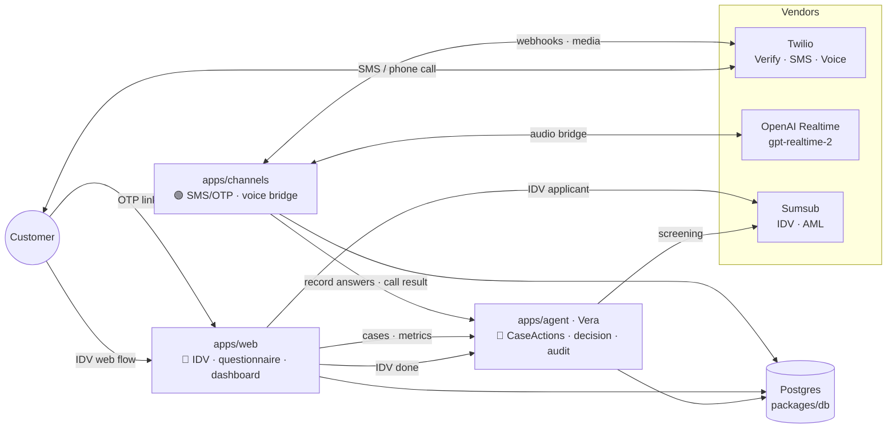

# TrustLine — Architecture & work map

Draft system map for the hackathon build. Fills the "Architecture — TODO" in
[AGENTS.md](../AGENTS.md). Owners can adjust their own sections.

> **The spine:** every track talks to a case through one contract — the
> `CaseActions` API (defined in `packages/shared`, implemented by the Brain
> agent). Channels and Frontend never mutate case state directly; they call
> actions, and the Brain advances the state machine + writes the audit trail.
> This is what lets the three tracks build in parallel.

## Service topology

```
packages/shared   types · single-source questionnaire · CaseActions contract · fixtures
packages/db       Prisma schema · case state machine · client (Postgres)

apps/agent     🔵 Brain     Vera (Google ADK). Owns CaseActions, decisioning, audit, metrics.   Cloud Run
apps/web       🔴 Frontend  Next.js + assistant-ui. IDV, self-service questionnaire, dashboard.  Cloud Run / Vercel
apps/channels  🟢 Channels  Node + Express + ws. Twilio SMS/OTP + Voice bridge. (NOT yet scaffolded — part of #4)  Cloud Run
```

`apps/channels` is a new service (issue #4) — Twilio needs a public HTTPS webhook
endpoint and a `wss://` socket for the voice bridge, which don't fit cleanly in
Next.js serverless route handlers. Keeping it standalone also isolates the
telephony blast radius from the UI.



## End-to-end flow (consumer onboarding)

| # | Step | Driven by | CaseActions / events |
|---|------|-----------|----------------------|
| 1 | Customer does document + liveness IDV | 🔴 Web (Sumsub) | `markIdvDone(caseId, passed)` → `IDV_DONE` |
| 2 | Dispatch SMS (OTP + web link + call-in number) | 🟢 Channels | `dispatchQuestionnaire(caseId)` → `QUESTIONNAIRE_SENT`, audit `SMS_SENT` |
| 3a | Customer completes via web (OTP-gated) | 🔴 Web | `recordAnswers(caseId, "WEB", answers)` → `QUESTIONNAIRE_DONE` |
| 3b | …or by calling the number | 🟢 Channels (voice) | `recordAnswers(caseId, "VOICE", answers)` |
| 4 | If stalled ~1 day, Vera calls them | 🟢 Channels (outbound) | writes `Call` + transcript to audit |
| 5 | Screening (sanctions/PEP/adverse media) + decide | 🔵 Brain (Sumsub) | `runScreening` → `SCREENING`; `decide` → `DECIDED` or `NEEDS_REVIEW` |
| 6 | Every step logged; metrics computed | 🔵 Brain | `AuditEvent` rows; `/api/metrics` feed |

Proactive re-verification (ID expiry, periodic re-KYC) re-enters at step 2 via
`REVERIFY_DUE → REVERIFY_SENT`, reusing the same channel + safety logic.

## Integration contracts (build against these, not each other)

- **`CaseActions`** (`packages/shared/src/index.ts`) — the spine. Brain implements
  it over Postgres; Channels + Frontend call it. Mock impl in
  `packages/shared/src/fixtures.ts` until Brain lands it.
- **Questionnaire** (`packages/shared/src/questionnaire.ts`) — defined once;
  `label`/options drive the web form, `voicePrompt` drives Vera's call, answers
  normalize to `field`. Both channels POST the same `Answers` bag.
- **State machine** (`packages/db` + `apps/agent/vera/state_machine.py`) — mirror
  TS/Python; keep in sync.
- **Audit** — Channels writes `Call`/transcript; Brain writes step events; the
  dashboard reads the ordered `AuditEvent` timeline.

---

## 🟢 Channels deep-dive (my track — #4, #5)

Source-of-truth skills used: `twilio-webhook-architecture`,
`twilio-sms-send-message`, `twilio-voice-conversation-relay`, `openai-docs`.

### `apps/channels` shape (proposed)

```
apps/channels/
  src/
    server.ts        Express app + ws upgrade; Twilio signature validation on all webhooks
    twilio.ts        Twilio REST client (Verify, Messaging, Voice)
    sms.ts           #4 — dispatch: Verify OTP + SMS body (link + call-in number)
    webhooks.ts      inbound SMS / status callbacks / voice TwiML
    voice/
      twiml.ts       #5 — returns <Connect><Stream> (or <ConversationRelay>) TwiML
      bridge.ts      #5 — WS bridge: Twilio media <-> OpenAI Realtime; tool-calls -> CaseActions
    caseClient.ts    calls Brain's CaseActions (mock fixtures until live)
```

### #4 — SMS / OTP dispatch  (no external onboarding; build first)

1. Twilio REST client from `TWILIO_ACCOUNT_SID` / `TWILIO_AUTH_TOKEN`.
2. **OTP** via Twilio **Verify** (`verifications.create`), verified at the web
   gate (`verificationChecks.create`) — Frontend (#6) redeems the session.
3. **SMS** via **Messaging Service** (`messagingServiceSid`) — body = OTP +
   `${APP_URL}/q/${caseId}` link + call-in number. Use a Messaging Service, not a
   raw `from`, for pumping protection + delivery.
4. Webhook endpoints with **SDK signature validation** (`X-Twilio-Signature`) —
   inbound SMS + status callbacks; return `204` for status, idempotent on
   `MessageSid+MessageStatus`.
5. On dispatch call `dispatchQuestionnaire(caseId)` and audit `SMS_SENT`.

### #5 — Vera voice  ⚠️ key decision

ConversationRelay (the Twilio voice skill) does its **own** ASR/TTS
(Deepgram/Google/Polly) and hands my server **text** — it would *not* use
`gpt-realtime-2`. AGENTS.md specifies OpenAI's realtime **speech** model as
Vera's voice, so the faithful path bridges raw audio to OpenAI:

| Option | How | Pros | Cons |
|---|---|---|---|
| **B — Media Streams ↔ OpenAI Realtime** ✅ recommended | `<Connect><Stream>` raw μ-law audio over `wss://` → bridge to OpenAI Realtime (`gpt-realtime-2`) | True speech-to-speech, natural voice, matches AGENTS.md, **no Twilio onboarding gate** | Audio format bridging (8k μ-law ↔ OpenAI), tool-calls wired into the Realtime session |
| C — Twilio SIP → OpenAI Realtime SIP | Route the call to OpenAI's SIP connector | Least Twilio glue | Less control over the bridge; verify SIP support in OpenAI docs |
| A — ConversationRelay + text LLM | Twilio ASR/TTS, my WS calls a text model | Simplest glue | **Onboarding is "not instant"** (hackathon risk); doesn't use `gpt-realtime-2` |

**DECISION — Option B (locked).** It both matches the spec and *removes* the
ConversationRelay onboarding risk. Before building, confirm the exact Realtime
audio format + tool-calling shape via the OpenAI Docs MCP (per `openai-docs` —
it's the source of truth; don't code from memory).

Voice build steps (Option B):
1. Inbound voice webhook → TwiML `<Start><Recording>` (disclosed) then
   `<Connect><Stream url="wss://…/voice">`.
2. WS bridge: relay Twilio media frames ↔ OpenAI Realtime; system prompt =
   Vera instruction + the `questionsForTier()` script for the case.
3. Realtime **tool-calls** → `recordAnswers` / `markIdvDone` etc. on CaseActions.
4. **Outbound fallback** (`calls.create`) when a case is stalled; same bridge.
5. Persist `Call` + transcript → audit; status callbacks update `CallStatus`.

### Trust & safety → implementation (hard constraints)

- **Authenticate the call to the customer** — opening turn references the code
  from their SMS *before* asking anything (inbound: gate on it; outbound: state it).
- **Disclose recording** — first spoken line + `<Start><Recording>` in TwiML.
- **No secrets by voice** — questionnaire has no secret-bearing fields; system
  prompt forbids soliciting full card/ID/SSN; OTP only over Verify.

### Local dev & env

- Tunnel for webhooks/WSS: **ngrok** (`brew install --cask ngrok`); free URLs
  rotate — re-point Twilio each restart.
- Env (already in `.env.example`): `TWILIO_*`, `OPENAI_API_KEY`,
  `OPENAI_REALTIME_MODEL=gpt-realtime-2`.
- Cloud Run for a stable URL once past local smoke tests.

### Risks / timeboxes

- **Audio bridge** is the riskiest piece — timebox to ~45 min to first audible
  round-trip; if stuck, drop to a canned/pre-recorded demo call and keep the
  outbound-trigger + audit path real.
- ConversationRelay (Option A) stays as the fallback *only if* onboarding
  happens to be already enabled on the account.
- Trial Twilio accounts can't SMS unverified numbers — verify demo numbers early.
